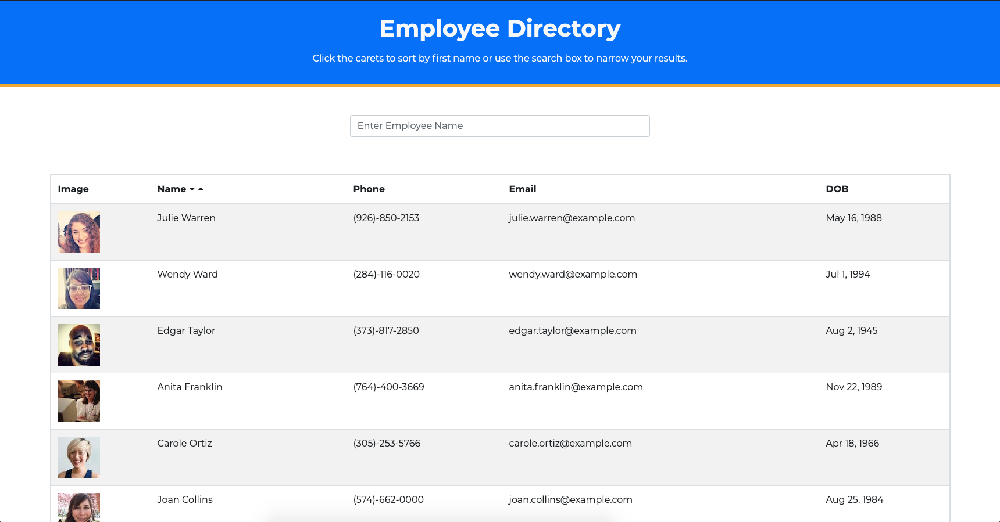

## Project Name

# Employee Directory

> This react application allows the user to view an entire employee directory at once and allows for search and sorting interaction.

#### [View The Site](https://agile-sands-10651.herokuapp.com/) - The project is live.

---

### Table of Contents

- [Description](#description)
- [Technologies](#technologies)
- [Installation](#installation)
- [How To Use](#how-to-use)
- [Test(s)](#tests)
- [Contributors](#contributors)
- [Questions](#questions)
- [License](#license)

---

## Description

This react application allows the user to view an entire employee directory at once. Upon load, the app will display all employees in the directory in a clean, easy to view table.

The user is able to search by employee name by entering the desired search into the text field.  This search feature is a live search and will filter the employee list with each keystroke. 

The user is able to sort the displayed list alphabetically by selecting the carets next to the 'Name' header.

[Back To The Top](#project-name)

---

## Technologies

 

- React.js, Javascript, node.js, JSX, HTML, CSS

[Back To The Top](#project-name)

---

## Installation

Simply click the following link to load the application in your browser.

#### [View The Site](https://agile-sands-10651.herokuapp.com/) - The project is live.

[Back To The Top](#project-name)

---

## How To Use

Once the application is loaded in the browser, simply enter the name of the employee to search by typing in the text field above the table of employees.

To sort the table alphabetically by first name (ascending or descending), simply click the carets next to the 'Name' header of the table.

[Back To The Top](#project-name)

---

## Tests

There are no tests.

[Back To The Top](#project-name)

---

## Contributors

- Nate Valline

[Back To The Top](#project-name)

---

## Questions

Please contact the following for any questions.

  =>  contact@natevalline.com

[Back To The Top](#project-name)

---

## License

MIT License

Copyright (c) 2020 Nate Valline

Permission is hereby granted, free of charge, to any person obtaining a copy
of this software and associated documentation files (the "Software"), to deal
in the Software without restriction, including without limitation the rights
to use, copy, modify, merge, publish, distribute, sublicense, and/or sell
copies of the Software, and to permit persons to whom the Software is
furnished to do so, subject to the following conditions:

The above copyright notice and this permission notice shall be included in all
copies or substantial portions of the Software.

THE SOFTWARE IS PROVIDED "AS IS", WITHOUT WARRANTY OF ANY KIND, EXPRESS OR
IMPLIED, INCLUDING BUT NOT LIMITED TO THE WARRANTIES OF MERCHANTABILITY,
FITNESS FOR A PARTICULAR PURPOSE AND NONINFRINGEMENT. IN NO EVENT SHALL THE
AUTHORS OR COPYRIGHT HOLDERS BE LIABLE FOR ANY CLAIM, DAMAGES OR OTHER
LIABILITY, WHETHER IN AN ACTION OF CONTRACT, TORT OR OTHERWISE, ARISING FROM,
OUT OF OR IN CONNECTION WITH THE SOFTWARE OR THE USE OR OTHER DEALINGS IN THE
SOFTWARE.

[Back To The Top](#project-name)

---
    